# Universal Document-level Information Extraction

This project was developed as part of the Document-level Information Extraction (DocIE) challenge. The objective is to extract entities, and relationships from long, unstructured documents. Our approach focuses on building a pipeline that combines Named Entity Recognition (NER) and Relation Extraction (RE) to produce structured outputs from raw text.

## Table of Contents

1. [Project Description](#project-description)
2. [Project Structure](#project-structure)
3. [Setup Instructions](#setup-instructions)
4. [Running the Project](#running-the-project)
6. [Team Contributions](#team-contributions)
7. [Results & Evaluation](#results--evaluation)

---

## Project Description

In this project we present a pipeline which utilizes two trained models, each specialized for either of the two tasks (NER, RE). They then sequentially extract entities from a given text, and then find the relations between those entities. In our solution the models have been separately trained and are then combined as one seemlessly integrated pipeline.

### Problem Statement

In real-world documents, critical information is often scattered across multiple sentences and paragraphs, making it challenging to extract structured knowledge at scale. The **Document-level Information Extraction (DocIE)** challenge addresses this problem by requiring models to identify **entities**, their **mentions**, and the **relationships** between them across an entire paragraph or document, rather than at the sentence level.

The challenge is divided into two key tasks:

- **Task 1: Named Entity Recognition (NER)** – Identify all entity mentions and classify them into predefined entity types across the paragraph.
- **Task 2: Relation Extraction (RE)** – Identify and classify all relationships between relevant pairs of entities, considering paragraph-level context.

## Project Structure

### 1. **Data Preprocessing**
The notebook `1a_NER_Preprocessing.ipynb` prepares and combines data for Named Entity Recognition (NER) model training. Since the DocIE challenge dataset is very limited (1,794 documents total, with only 74 containing entity annotations), we augment it using the OntoNotes 5.0 dataset, which employs the same entity label set. The combined data is then saved in a unified JSON format suitable for model training.

**Key Steps**

**1. Loading DocIE Challenge Data**

First, the script reads the original DocIE files (JSON, CSV, or other specified format) from the input directory and filters down to the 74 annotated documents that contain the entity labels needed for NER. This ensures that only examples with valid annotations are included in the initial dataset.

**2. Fetching and Reformatting OntoNotes 5.0**

Next, the script uses Hugging Face’s `datasets` library to load the OntoNotes 5.0 dataset. Each example from OntoNotes is converted into the same JSON schema as the DocIE data so that they share keys like `title`, `doc`, and `mentions` (with identical entity label names). This refactoring step guarantees that the combined set is homogeneous and can be processed uniformly.

**3. Merging and Saving Dataset**

After refactoring OntoNotes examples, the script concatenates the filtered DocIE examples with the reformatted OntoNotes examples. Finally, the merged dataset is serialized into a single JSON file (e.g., `combined_ner_data.json`). Each entry in the output follows the schema:
```json
{
  "title": "Title of the document",
  "doc": "Full document text here ...",
  "entities": [
    {
      "id": 0,
      "type": "ENTITY_TYPE",
      "mentions": [
        "Mention of the etity"
      ]
    }
  ]
}
```

### 2. **NER Baseline Evaluation**
As a baseline for the NER task, we used the `meta-llama/Meta-Llama-3-8B-Instruct` model via the Hugging Face `transformers` pipeline. We followed a zero-shot prompting approach, however, the model received instructions that defined the desired entity schema explicitly. The inference was done using natural language prompts containing both system and user roles, guiding the model to output entities grouped by predefined categories. Below is the prompt which was used for establishing the baseline:
```json
{
  "role": "system", 
  "content": f"You are an expert in Named Entity Recognition. Please extract entities that match the schema definition from the input. Return an empty list if the entity type does not exist. Please respond in the format of a JSON string.\", \"schema\": {labels}"
},
{
  "role": "user", 
  "content": "Full document text here ..."
},
```

The script loads raw data, constructs prompts with a system message instructing the model to perform NER, and includes the list of entity labels as a schema. Each document is passed to the model, and the output is parsed to extract the JSON-encoded entity results. A helper function attempts to clean and extract valid JSON from the model's generated text and optionally saves the output to disk.

### 3. **Named Entity Extraction (Task 1 - NER)**
The notebook `3a_NER_Training.ipynb` handles the construction of training and validation datasets for NER, configures a Longformer-based model, and orchestrates both baseline and final evaluations. It begins by loading and merging JSON files from the DocIE challenge and OntoNotes datasets, then creates label mappings and splits data into training and validation sets. After tokenization and annotation with BIO tagging, a Longformer model is initialized, chosen for its efficiency on long documents and a baseline evaluation is performed on the validation split. Following that, the Hugging Face Trainer is configured to train the model, and finally, a full evaluation on the validation set is run using the trained weights.

**Key Steps**

**1. Loading and Preparing the Raw Data**

First, the notebook iterates through all JSON files from both the DocIE challenge and the previously generated OntoNotes dataset, extracting document texts and their associated annotations. It then constructs a label mapping by collecting every unique entity label across both sources. Once this label map is finalized, the combined set of examples is randomly shuffled and split into distinct training and validation subsets, ensuring that each split contains a representative distribution of entities.

**2. Initializing the Longformer Model**

Next, the notebook loads a pretrained Longformer model from Hugging Face’s model hub. Longformer is particularly well-suited for NER tasks on longer documents because it uses sparse self-attention, allowing it to process extended sequences efficiently without the quadratic memory blow-up typical of standard Transformers. This is crucial when documents can span thousands of tokens, as it retains contextual information over long passages while remaining computationally feasible.

**3. Tokenization and Annotation Alignment**

In order to create a Hugging Face–compatible dataset, each document is manually tokenized using the Longformer tokenizer. As tokens are produced, the code aligns the original character‐level entity spans with token indices, mapping each character-based annotation into token-based labels. During this process, the existing entity labels (e.g., `PERSON`, `ORG`, `GPE`) are extended using the BIO prefix scheme `B-`, `I-`, and `O` so that each token is assigned a tag reflecting whether it begins or continues an entity, or lies outside any entity.

**4. Baseline Evaluation on Validation Data**

Before any training occurs, a baseline evaluation is performed using the untrained Longformer model (with randomly initialized classification heads). This baseline step computes standard NER metrics-precision, recall, and F1 on the validation set, offering a point of comparison to gauge the benefit of subsequent training. Because the model has not yet seen any data, baseline scores typically reflect how well the pretrained encoder alone can distinguish entity patterns without supervised fine-tuning.

**5. Configuring Trainer and Starting Training**

Once the dataset and model are prepared, the notebook defines training arguments (such as learning rate, batch size, number of epochs, and evaluation strategy) and instantiates Hugging Face’s `Trainer` object. The Trainer handles batching, loss computation (cross-entropy over BIO tags), gradient updates, and periodic evaluation on the validation split. Finally, a training loop is launched, which fine-tunes the Longformer encoder and its token classification head on the NER training data over the specified number of epochs.

**6. Final Evaluation on Validation Set**

After training completes, the notebook uses the best saved checkpoint to perform a final evaluation on the validation split. It applies the trained model to the held‐out documents, converts predicted logits into BIO-tag sequences, and compares these predictions to the ground-truth annotations. The results precision, recall, and F1 for each entity type and overall are then reported, demonstrating the improvement achieved through fine-tuning.

### 4. **Relation Extraction (Task 2 - RE)**
The notebook `3b_RE_Training.ipynb` implements the end‐to‐end workflow for training a supervised Relation Extraction (RE) model. It begins by loading and transforming the raw JSON files from the RE dataset, constructing a tabular representation of sentence‐level examples with entity pairs and their relation labels. The examples are split into training, validation, and test subsets, and then tokenized and encoded for a SpanBERT‐based sequence‐classification model. A baseline evaluation using the pretrained model is conducted on held‐out splits before fine‐tuning. Finally, the model is trained via Hugging Face’s Trainer API and evaluated again to report final metrics on validation (and test) sets.

**Key Steps**

**1. Loading and Structuring Raw Data**

The notebook first navigates through all JSON files in the designated RE data directory (e.g., `Datasets_RE/train`). For each JSON, it extracts sentences and their annotated entity pairs, which is typically a “head” entity and a “tail” entity, along with the labeled relation between them. Each row in a temporary list captures `"entity1"`, `"entity2"`, `"text"`, and `"relation"`. Once all files have been processed, this list is converted into a Pandas DataFrame (`relation_dataset.csv`), in which each row corresponds to one candidate sentence containing both entities. This CSV makes it easier to inspect label distributions and to perform a stratified split.

**2. Splitting into Training, Validation, and Test Sets**

Next, the script reads the consolidated `relation_dataset.csv` into a DataFrame and prints the count of examples per relation type to confirm class balance. Using scikit‐learn’s `train_test_split`, it first reserves 20% of the data as a temporary hold‐out set, then splits that hold‐out set evenly into validation and test subsets (10% each of the original). As a result, 80% of the examples become training data, while 10% each are held back for validation and testing. This three‐way split ensures that hyperparameter tuning and early stopping decisions can be made on validation data without ever touching the test set.

**3. Tokenization and Example Preparation**

With the three splits defined as Pandas DataFrames, the notebook constructs Hugging Face `Dataset` objects from them. A tokenizer (SpanBERT’s tokenizer in this case) is loaded using `AutoTokenizer.from_pretrained(MODEL_NAME)`. A custom function `make_example` is applied to each example: it inserts special markers or context windows around the two entities in the sentence, tokenizes the text into input IDs and attention masks, and assigns a `relation_label` string to an intermediate field. After tokenization, the example retains only the tokenized inputs plus the original `relation_label`. This mapping is performed in batched mode on the Hugging Face `DatasetDict` to produce `token_input_datasets`.

**4. Constructing Label Mappings**

Once all tokenized splits are in memory, the notebook collects every unique `relation_label` string from the training split and sorts them. A dictionary `label2id` is created to map each relation (e.g., `"works_for"`, `"located_in"`) to a unique integer index; its inverse `id2label` is also stored. A helper function `add_label_ids` replaces each example’s `relation_label` string with its corresponding integer under a new field `"labels"`. By applying `add_label_ids` over all splits, the final datasets (`final_datasets`) contain the necessary `"input_ids"`, `"attention_mask"`, and `"labels"` fields for training a sequence‐classification head.

**5. Baseline Evaluation on Held‐out Splits**

Before any gradient updates, the notebook instantiates a pretrained SpanBERT (or similar) sequence‐classification model via `AutoModelForSequenceClassification.from_pretrained(MODEL_NAME, num_labels=…)`. This “baseline model” uses the pretrained weights of the encoder with a randomly initialized classification head. Using the same `Trainer` configuration that will later be used for training, the baseline is evaluated on both the validation and test splits. Cross‐entropy loss, precision, recall, F1‐score, and accuracy are computed and logged (e.g., to Weights & Biases). This untrained baseline helps gauge how well the pretrained encoder already captures relation cues.

**6. Configuring the Trainer and Fine‐tuning**

After recording baseline metrics, the notebook defines `TrainingArguments` (learning rate, batch size, number of epochs, weight decay, evaluation strategy, and checkpointing settings). A new `Trainer` object is initialized with the model, `TrainingArguments`, training and validation datasets, a metrics‐computation function (using `seqeval` or custom code for multi‐class classification), and a `DataCollatorWithPadding` to dynamically pad batches. The `trainer.train()` call then iteratively fine‐tunes SpanBERT on the training split, periodically evaluating on the validation split to monitor progress and save the best checkpoint.

**7. Final Evaluation with the Trained Model**

Upon training completion (or early stopping), `Trainer` auto‐loads the best checkpoint (i.e., lowest validation loss or highest F1). The notebook then runs `trainer.evaluate()` on the validation split one final time to compute updated metrics. Optionally, it also does `trainer.predict()` on the held‐out test split to report test‐set performance. The results are logged and saved (e.g., as CSV or via Weights & Biases tables) for later analysis or reporting.


### 5. **Complete Pipeline**
The notebook `5_Complete_Pipeline.ipynb` stitches together the separately trained Named Entity Recognition (NER) and Relation Extraction (RE) models into a single end‐to‐end inference pipeline. Given a raw document, the pipeline first runs the NER module to identify entities and their spans. The detected entities are then passed to the RE model, which predicts relational triples (head entity, tail entity, and relation type). The final output is a JSON list of document‐level relation triples.

**Key Steps**

**1. Loading Pretrained NER and RE Models**

At the start, the notebook loads the fine‐tuned NER model checkpoint (e.g., a Longformer‐based token classifier) and its tokenizer so that raw text can be tokenized identically to training. Likewise, it loads the SpanBERT (or chosen) RE model checkpoint along with its tokenizer. Both models are set to evaluation mode (no gradient updates), ensuring that the pipeline runs efficiently during inference.

**2. Running NER Inference on Raw Documents**

Next, the notebook ingests each document as a raw text string (and optionally a `doc_title` and `domain` label). For each document, the text is tokenized and fed into the NER model. The model’s output logits are converted into BIO‐tag sequences, which are then collapsed back into entity spans. Each detected entity is represented as:
```json
{
  "entity_group": "PERSON",
  "score": 0.75024338364601135,
  "word": "Barack Obama",
  "start": 24,
  "end": 36
}
```

## Setup Instructions

1. **Download Project Files**
Go to this link and download the folder. Put the folder to the project root.

2. **Run Jupyter Notebooks**
In advance of every notebook the needed packages are installed and imported. No further setup is needed. 

> [!NOTE]  
> It is recommended to work with either Conda or any other virtual enviornment.
> The training and complete pipeline notebooks can also be run from Google Colab. Please make sure to copy the project_files folder to your Google Drive.

---

## Running the Project

The project_files folder contains all relevant data to run `5_Complepte_Pipeline.ipynb`. However, to reproduce our preprocessing and training steps the notebooks can be run in the following order:
1. `1a_NER_Preprocessing.ipynb` - Data preprocessing
2. `2_Baseline.ipynb` - Establishing a baseline wiht Llama-3-8b model
3. `3a_NER_Training.ipynb` - NER Model training
4. `3b_RE_Training.ipynb` - RE Model training
5. `5_Complete_Pipeline.ipynb` - Demonstration of the final pipeline
6. `4a_NER_Evaluation.ipynb` - Can additionally be run to get some visualizations of the training data.

---

## Team Contributions

| Name                          | Contributions                                  |
|-------------------------------|------------------------------------------------|
| Daniel Locher                 | NER training data preprocessing                |
| Daniel Locher                 | Baseline model evaluation                      |
| Daniel Locher                 | NER model training                             |
| Daniel Locher                 | NER training data analysis and visualization   |
| Nina Krebs                    | RE training data preprocessing                 |
| Nina Krebs                    | RE baseline evaluation                         |
| Nina Krebs                    | RE model training                              |
| Nina Krebs                    | RE training data analysis and visualization    |
| Nina Krebs & Daniel Locher    | Complete pipeline development                  |

---

## Results & Evaluation

### NER Results

To evaluate the performance of the LLaMA-3-8B-Instruct baseline for named entity recognition, we tested it on two domains collections: *Internet* and *Human Behavior*. We used a zero-shot prompting approach. On the *Internet* dataset, the model achieved an average precision of 0.42, recall of 0.25, and an F1 score of 0.24. On the *Human Behavior* dataset, although the precision was slightly higher at 0.50, the recall dropped significantly to 0.10, resulting in a lower F1 score of 0.16. Overall, while useful as a zero-shot baseline, the LLaMA model falls short of the performance achieved by task-specific, fine-tuned models.

Building up on this insight, we started with the fine-tuning of the Longerformer model. Initial training was conducted on a small subset of 1,000 documents using only the default parameters of Hugging Face Trainer API. Only the learning rate was adjusted. A value of `1e-5` yielded the most stable training and evaluation curves and resulted in an F1 score of 0.6. Below the comparison of the F1 and the evaluation loss is visible between different learning rates.

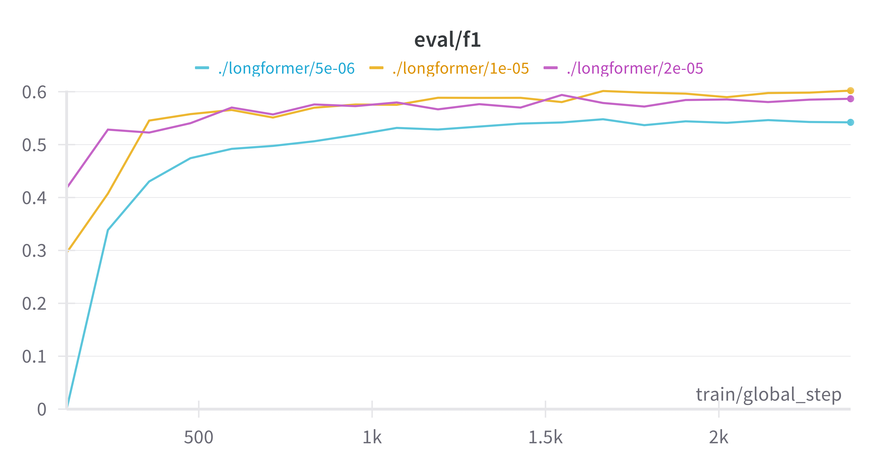 
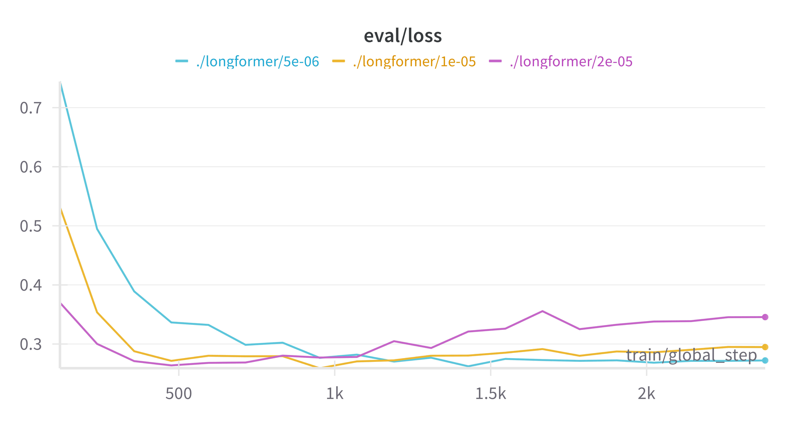

Building on this, the full dataset of 50,000 documents was used, which immediately improved the F1 to 0.8. After further tuning, a final F1 score of 0.89 on the validation set was achieved. The best-performing configuration used the following hyperparameters:

`train_batch_size=32`, `eval_batch_size=64`, `gradient_accumulation_steps=2`, `num_epochs=12`, `learning_rate=1e-5`, `warmup_ratio=0.1`, and `weight_decay=0.01`


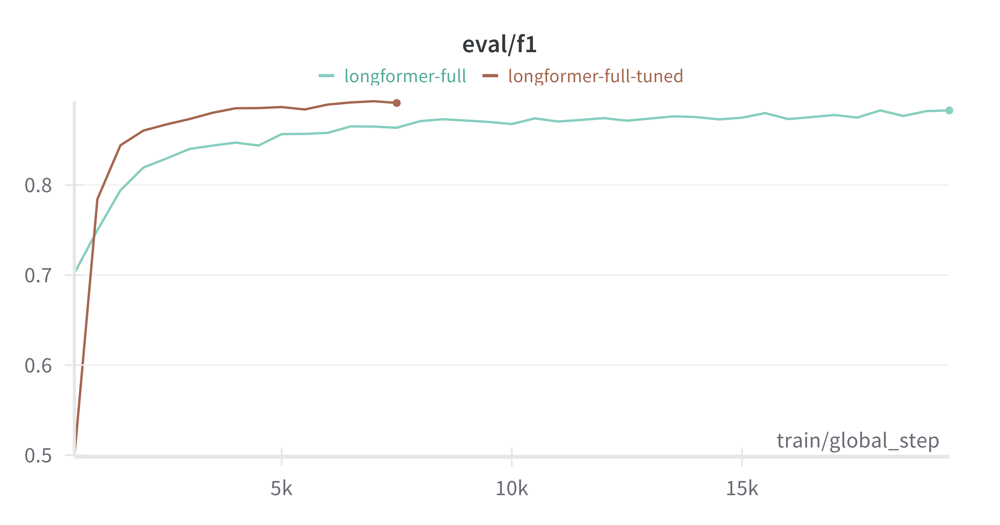

**Limitations & Challenges**

However, when this trained model was applied to unseen documents outside the validation set, the F1 score dropped significantly to 0.3. After a thorogh analysis, it became clear that this drop was due to imbalanced label distribution in the training data. Some entity labels occurred frequently, while others were underrepresented. The graph belows displays the frequency of all entity labels in our dataset. 

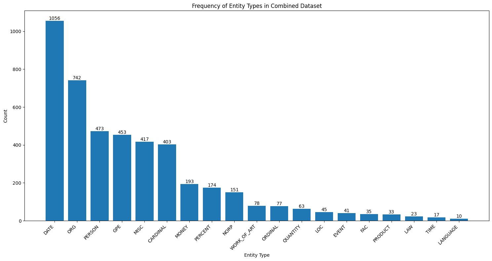

Per-label F1 analysis showed strong performance (0.78 to 0.5) for common entities, but very low or zero F1 for rare ones. A similar trend was observed in model confidence: predictions for common labels had high certainty (0.8–0.99), whereas rare-label predictions were uncertain and resembled random guesses. The following graphs show the frequency of prediction confidence for one of the most and one of the least appearing entites. 

<p float="left">
  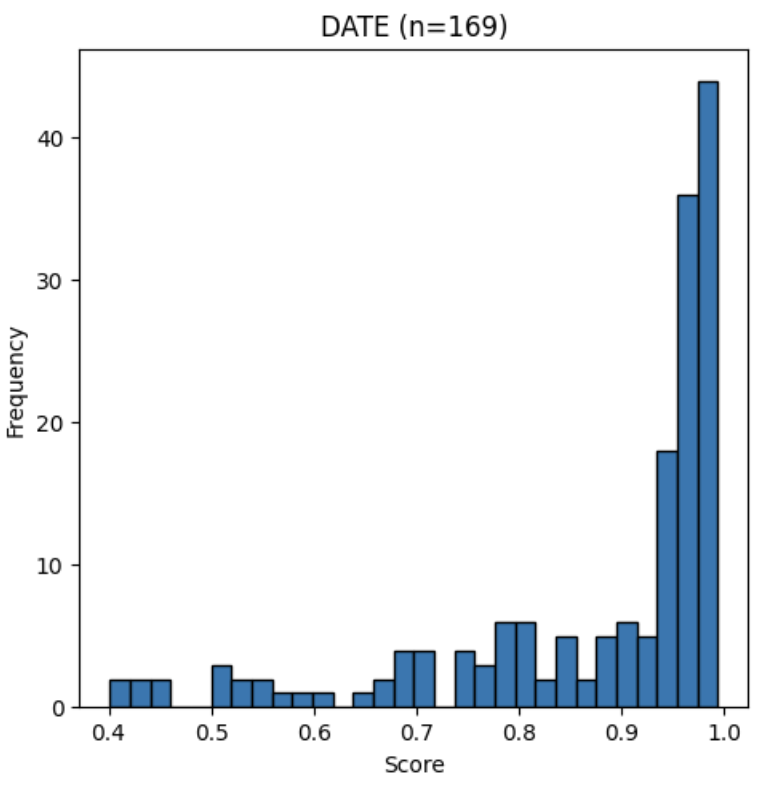 
  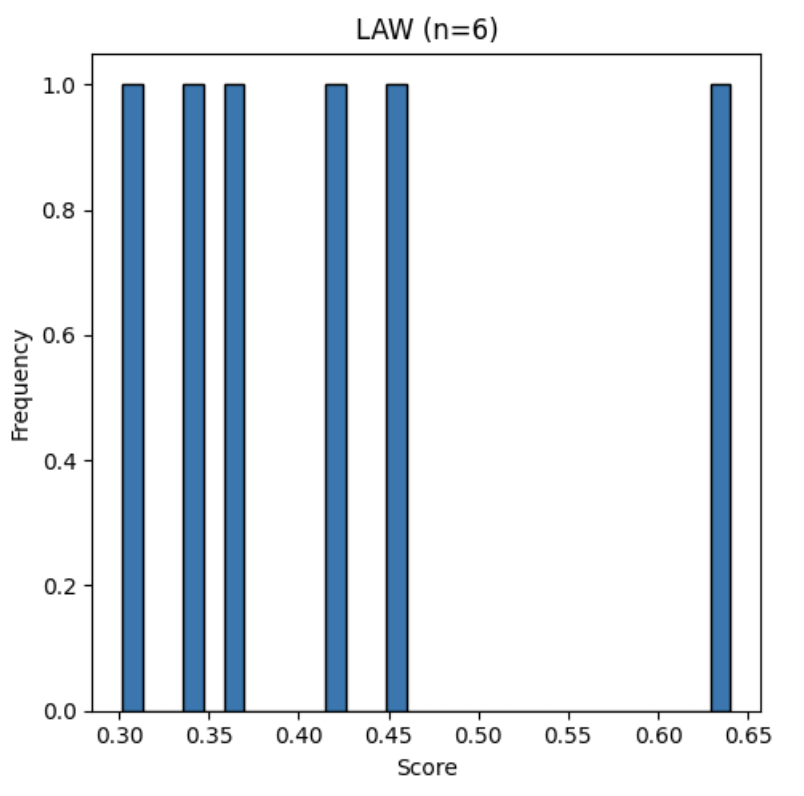
</p>

In conclusion, we are confident to say that we have evidence that the NER training has worked. However the outcome was limiteded due to the insufficiently diverse training data. 

### RE Results
We first finetuned SpanBERT on the challenge dataset for 20 epochs with a learning rate of 2e-5 and batch size 16. Training loss decreased steadily, but validation accuracy peaked at approximately 0.7143 before settling around 0.6667 after about eleven epochs. Validation F1 peaked near 0.3879 after five epochs, then fell and stabilized around 0.30 after eleven epochs. These moderate results led us to create and use a larger custom RE dataset.

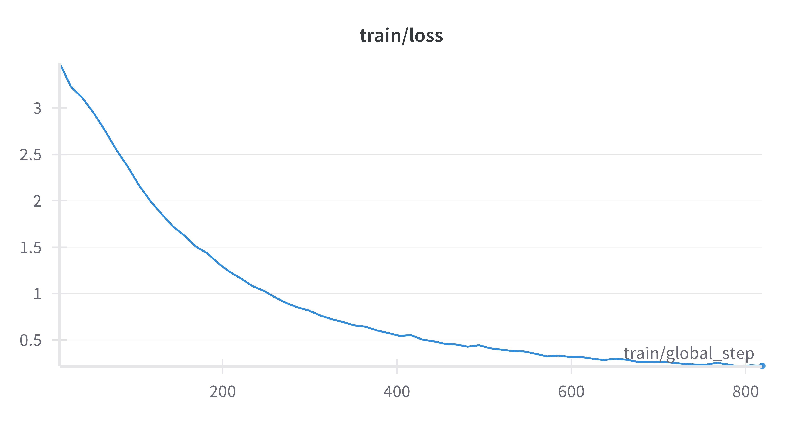 
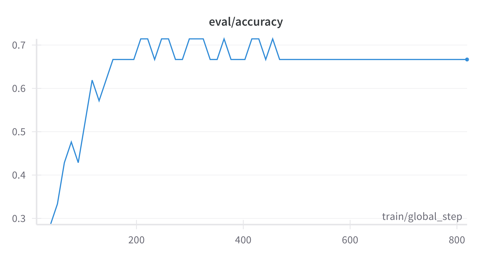

On the custom RE dataset, we began by evaluating SpanBERT without finetuning on the validation set. We then performed hyperparameter optimization in three stages. First, we tested learning rates of 1e-5, 2e-5, 3e-5, and 5e-5 over 50 epochs (batch size = 16). The model with lr = 2e-5 consistently outperformed the others, achieving an F1 near 0.841 and accuracy near 0.862, whereas lr = 5e-5 failed (F1 = 0.000, accuracy = 0.011). We therefore fixed lr = 2e-5 for later experiments.

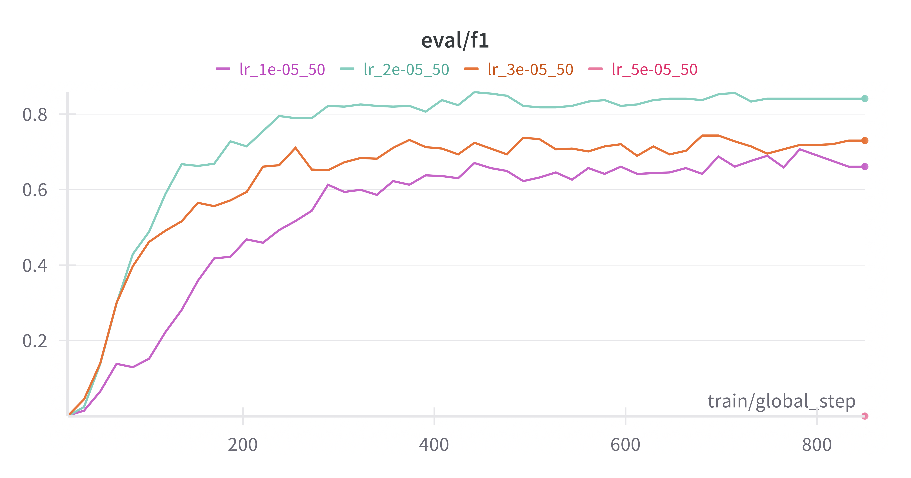 
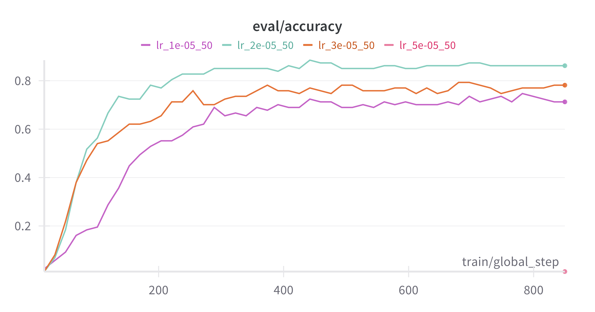

Next, with lr = 2e-5 and batch size = 16, we ran a 200‐epoch stability check to ensure performance did not collapse late and to find when peak performance occurred. After 200 epochs, the model achieved precision = 0.812, recall = 0.862, F1 = 0.828, and accuracy = 0.862. The highest metrics appeared around epochs 20–30, so we chose 20 epochs for final training to maximize efficiency without sacrificing performance.

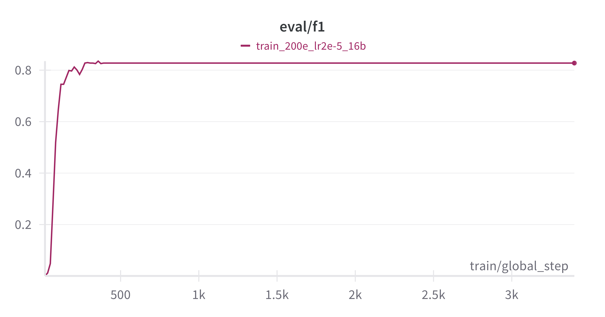 
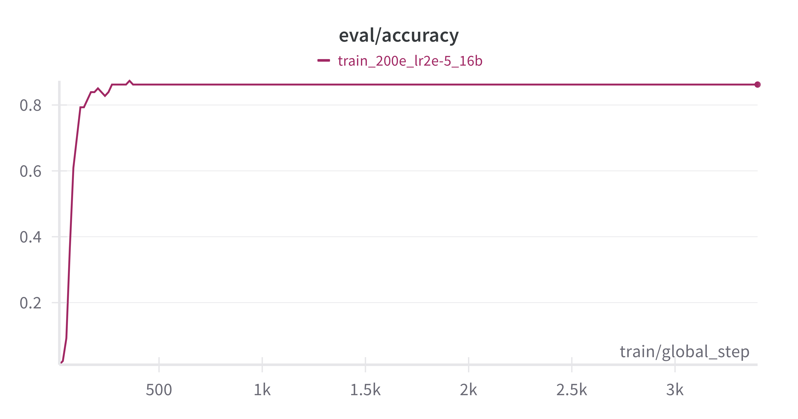

Finally, we tested batch sizes of 8, 16, and 24 over 50 epochs (lr = 2e-5). Batch = 8 yielded slightly higher F1 and accuracy than batch = 16, but the difference was small. We selected batch = 16 for faster training and comparable performance.

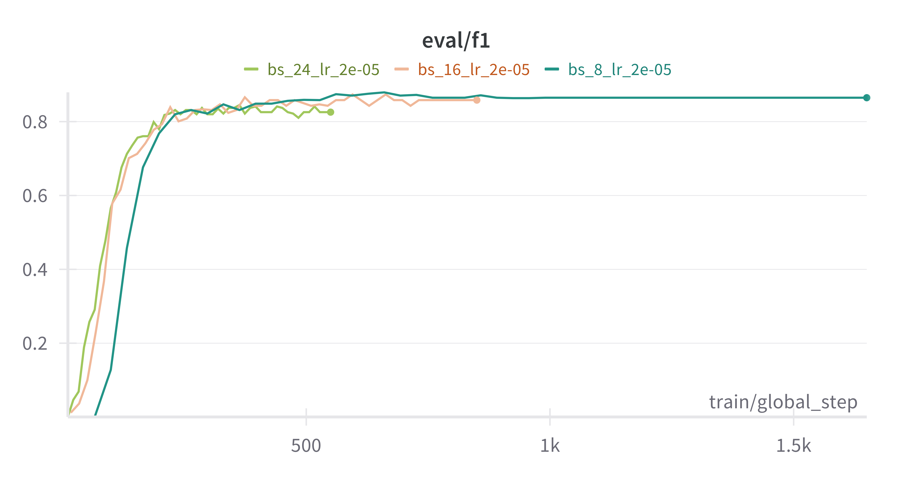 
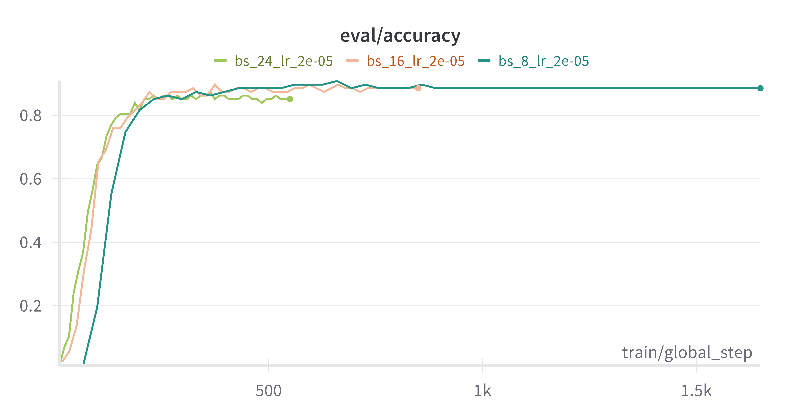

In the final training run (lr = 2e-5, 20 epochs, batch = 16), the model reached precision = 0.833, recall = 0.874, F1 = 0.847, and accuracy = 0.874 on the validation set. Performance plateaued well before 20 epochs, confirming our hyperparameter choices. The resulting finetuned model checkpoint is included in this repository for downstream RE evaluations.

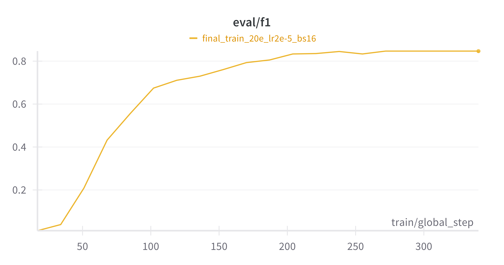 
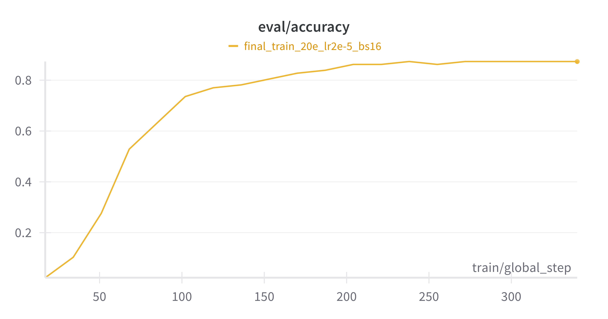

### Combined NER + RE Pipeline

When applying the full pipeline, NER followed by RE to new documents, the NER model was able to extract entities with reasonably high confidence for frequent labels, aligning with its validation performance. However, since the RE model failed to generalize, it was not able to produce any meaningful relation triples from the extracted entities. As a result, the overall pipeline output consisted of isolated entities without any detected relationships, limiting its utility for downstream information extraction tasks.


